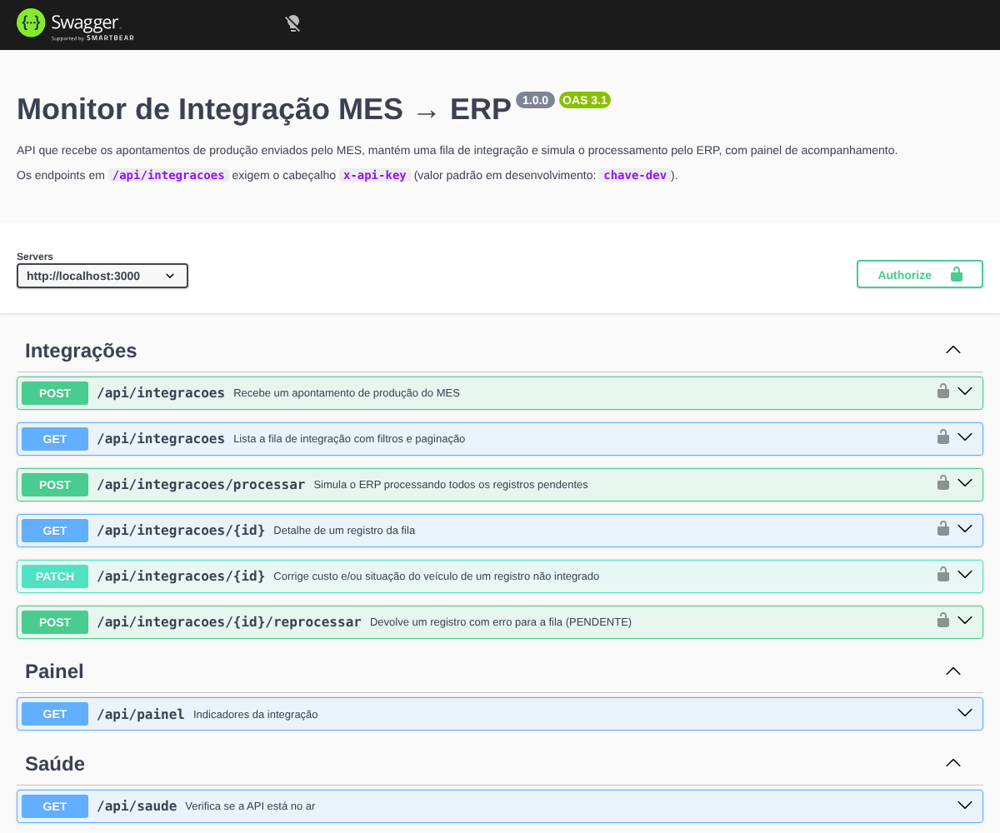

# Monitor de Integração MES → ERP


API REST que recebe os apontamentos de produção enviados pelo MES (sistema de chão de fábrica), mantém uma **fila de integração** e simula o processamento pelo ERP. O foco do repositório é **teste de API**:

- contrato **OpenAPI 3.1** documentado e servido com Swagger UI
- **testes de contrato** que falham se a resposta sair do documentado
- coleção **Postman** executada no CI com **Newman**

> **Origem:** projeto inspirado em um painel real de monitoramento de integração que mantenho no trabalho, originalmente em ColdFusion com Oracle e SQL Server. Aqui ele foi reescrito do zero em Node.js, com dados fictícios e sem nenhum código ou informação da empresa. O defeito documentado em `docs/bugs` foi encontrado no sistema original.



## Como funciona

```
MES ──POST /api/integracoes──▶ fila (PENDENTE) ──POST /processar──▶ INTEGRADO
                                                       │
                                                       └──▶ ERRO ──PATCH (correção)──▶ /reprocessar ──▶ PENDENTE
```

| Regra | Descrição |
|---|---|
| Validação na entrada | Ordem `OP000000`, VIN com 17 caracteres sem I/O/Q, data real e não futura, hora `HH:MM` ou `HHMM` |
| Idempotência | A mesma ordem + VIN não entra duas vezes (409) |
| Processamento | Custo zerado ou situação do veículo vazia geram ERRO; os motivos são acumulados |
| Correção | Só custo e situação podem ser corrigidos, e só antes de integrar |
| Reprocessamento | Apenas registros com ERRO voltam para a fila |
| Segurança | Endpoints de integração exigem `x-api-key` |

## Testes

| Camada | Ferramenta | Qtd. | O que cobre |
|---|---|---|---|
| Unitário | Jest | 57 | VIN, datas, hora, validações e regras de processamento |
| API + contrato | Jest + Supertest + Ajv | 31 | Fluxos HTTP; cada resposta é validada contra o `openapi.yaml` |
| Caixa-preta | Postman + Newman | 23 requisições / 88 asserções | A API rodando de verdade, em 5 pastas encadeadas |

Cobertura de código (Jest): **~97% das linhas**.

**Destaques:**

- **Teste de contrato próprio:** o matcher `expect(res).toSatisfyContract('post', '/api/integracoes')` (em `tests/helpers/contrato.js`) falha quando:
  - o status retornado não está documentado
  - falta um campo, o tipo está errado ou aparece um campo extra
- **Transições de estado:** os caminhos permitidos e os proibidos são testados (ex.: corrigir registro já integrado → 409).
- **Coleção independente de dados:** ordem e VIN únicos gerados em pré-request, ids encadeados por variáveis. Pode rodar várias vezes seguidas.
- **Validações globais na coleção:** toda requisição verifica tempo de resposta e `Content-Type`.
- **Mutação manual:** mudei um tipo na resposta e reintroduzi o bug antigo para confirmar que os testes pegam os dois.

## Documentação de QA

- [Plano de testes](docs/plano-de-testes.md)
- [Casos de teste](docs/casos-de-teste.md): 34 casos com prioridade e camada de automação
- [BUG-001: hora da última integração exibida como "19::2"](docs/bugs/BUG-001-hora-exibida-como-19--2.md)

## Como rodar

Requer **Node.js 22.13+** (usa o SQLite nativo do Node).

```bash
npm install
npm start                  # API em http://localhost:3000 e Swagger em /docs

npm test                   # unitários + API + contrato
npm run test:coverage      # com cobertura

# com a API rodando, em outro terminal:
npm run test:postman       # coleção Postman via Newman (gera reports/newman.xml)
```

Para usar no Postman: importe `postman/monitor-integracao.postman_collection.json` e o ambiente `postman/local.postman_environment.json`.

## Exemplo

```bash
curl -X POST http://localhost:3000/api/integracoes \
  -H "Content-Type: application/json" -H "x-api-key: chave-dev" \
  -d '{"ordem":"OP000123","vin":"9BWZZZ377VT004251","modelo":"SUV-M","quantidade":1,
       "custo":85230.5,"situacao_veiculo":"PRODUZIDO","data_producao":"2026-03-10","hora_producao":"1925"}'
```

## Estrutura

```
src/
  regras.js       regras de negócio puras
  app.js          rotas da API (Express) e Swagger UI
  db.js           schema SQLite
openapi.yaml      contrato da API (fonte da verdade da documentação e dos testes de contrato)
tests/
  unit/           Jest
  api/            Jest + Supertest + validação de contrato
  helpers/        matcher toSatisfyContract
postman/          coleção e ambiente
scripts/          gerador da coleção Postman
docs/             plano de testes, casos de teste e relatório de bug
```

## Stack

Node.js 22 · Express 5 · SQLite (`node:sqlite`) · OpenAPI 3.1 · Swagger UI · Jest · Supertest · Ajv · Postman · Newman · GitHub Actions

---

Feito por [Marcelo Rodrigues](https://www.linkedin.com/in/marcelo-rodrigues-macedo-filho-b657432b1) · veja também [controle-quimicos-qa](https://github.com/VitraSan/controle-quimicos-qa)
